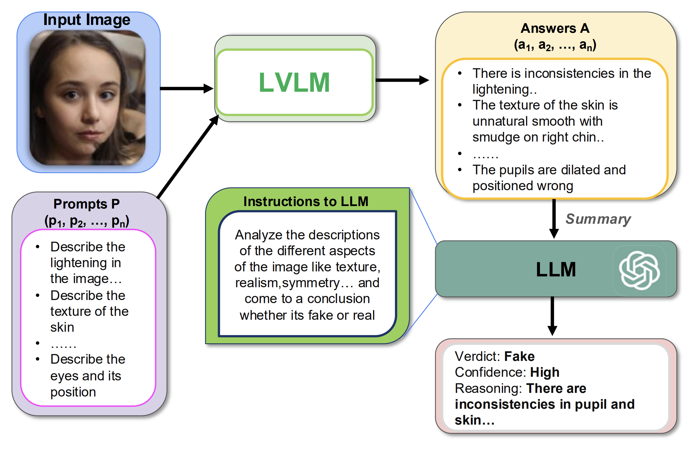
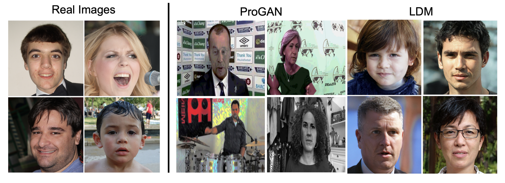
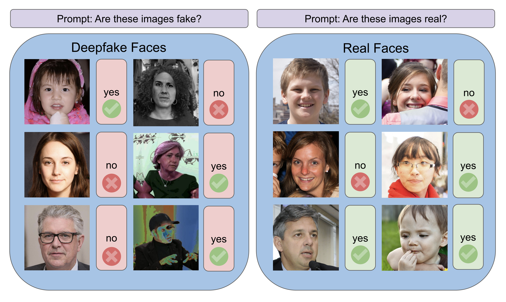
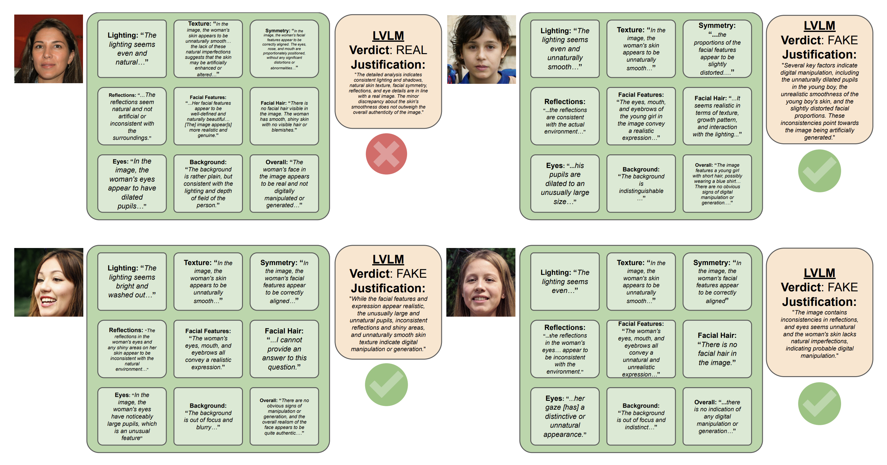

# TruthLens: Training-Free Data Verification for Deepfake Images via VQA-style Probing

Ritabrata Chakraborty, Rajatsubhra Chakraborty, Ali Khaleghi Rahimian

*Data in Generative Models Workshop (DIG-BUGS) at ICML 2025, Vancouver, Canada*

[Paper (ICML 2025 virtual page)](https://icml.cc/virtual/2025/51033) · [Poster](docs/figures/poster.png) · [arXiv](https://arxiv.org/pdf/2503.15342)

TruthLens casts deepfake image detection as visual question answering (VQA). A large
vision-language model (LVLM) answers a fixed set of artifact-oriented questions about an
image. The answers are aggregated into a textual summary, and a large language model (LLM)
reasons over that summary to produce a verdict (REAL/FAKE) and a natural-language
justification. The method involves no training or fine-tuning.



*Figure 1. Overview of the TruthLens pipeline.*

---

## Contents

- [Method](#method)
- [Repository structure](#repository-structure)
- [Installation](#installation)
- [Data preparation](#data-preparation)
- [Usage](#usage)
- [Configuration and outputs](#configuration-and-outputs)
- [Reproducing the paper](#reproducing-the-paper)
- [Testing](#testing)
- [Limitations](#limitations)
- [Citation](#citation)
- [License and acknowledgements](#license-and-acknowledgements)

## Method

Given an image *I*, TruthLens proceeds in four steps (paper §2):

1. **Question generation.** A fixed prompt set *P* = {*p*₁, …, *p*₉} probes nine artifact
   categories: lighting and shadows, texture and skin details, symmetry and proportions,
   reflections and highlights, facial features and expression, facial hair, eyes and
   pupils, background and depth perception, and overall realism of the face. The prompts
   are reproduced verbatim from Appendix B in
   [`truthlens/prompts.py`](truthlens/prompts.py); `truthlens prompts` prints them.
2. **Multimodal reasoning.** An LVLM *f*_MM answers each prompt: *a*ᵢ = *f*_MM(*I*, *p*ᵢ).
   The main model is Chat-UniVi; BLIP-2, LLaVA-1.5 and CogVLM are also supported
   (Table 2).
3. **Textual aggregation.** The answers are combined into a summary *S* = *g*(*A*). By
   default, *g* produces one labelled block per category.
4. **Final decision.** An LLM *f*_LM maps *S* to a verdict *y* ∈ {REAL, FAKE} and a
   justification *r*.

## Repository structure

```
TruthLens/
├── truthlens/                 # TruthLens implementation (installable package, CLI: `truthlens`)
│   ├── prompts.py             #   probe set P (App. B), category presets, Yes/No prompt
│   ├── lvlm/                  #   f_MM backends: chatunivi, blip2, llava15, cogvlm, mock
│   ├── aggregate.py           #   g(A) -> S (structured | pipe)
│   ├── judge.py               #   f_LM: prompts, OpenAI backend, robust verdict parsing
│   ├── metrics.py             #   per-class accuracy, P/R/F1, AUC (NumPy only)
│   ├── data.py                #   dataset manifests
│   ├── pipeline.py            #   resumable stages: probe, aggregate, judge, evaluate, yesno
│   ├── config.py              #   YAML config, defaults, --set overrides
│   └── cli.py
├── configs/                   # experiment configurations (see "Reproducing the paper")
├── scripts/                   # smoke test, paper/ablation drivers, baseline folder builder
├── baselines/                 # vendored CNNDetection and DIRE (+ TruthLens evaluation scripts)
├── tests/                     # pytest suite
├── docs/                      # documentation and figures
│   ├── REPRODUCIBILITY.md     # environments, experiment map, seeds, known differences
│   ├── DATA.md                # datasets, manifests, importing per-category outputs
│   └── figures/               # paper figures and poster
├── pyproject.toml, requirements*.txt
├── CITATION.cff
└── README.md
```

## Installation

The core package (aggregation, judge, evaluation) needs Python ≥ 3.9 and no GPU.
Clone or download this repository, open a terminal in its root directory, and install
the package:

```bash
pip install -e ".[judge]"          # add ",dev" for the test suite
```

LVLM probing requires a CUDA GPU and the LVLM's own software stack:

* **Chat-UniVi** (main model). Install it by following its instructions, which pin their
  own torch/transformers, and then install TruthLens into the same environment:

  ```bash
  git clone https://github.com/PKU-YuanGroup/Chat-UniVi
  pip install -e Chat-UniVi
  pip install -e .
  python -c "import ChatUniVi; print('ChatUniVi import OK')"
  ```

* **BLIP-2 / LLaVA-1.5** via Hugging Face: `pip install -e ".[hf,judge]"`. CogVLM
  requires the `transformers` version given in its model card.

The judge reads the API key from the environment only:

```bash
export OPENAI_API_KEY=...            # optionally OPENAI_BASE_URL for OpenAI-compatible servers
```

The baselines use separate environments; see [`baselines/README.md`](baselines/README.md).
Environment details are in [`docs/REPRODUCIBILITY.md`](docs/REPRODUCIBILITY.md).

## Data preparation

The paper evaluates on 1,000 real FFHQ faces, 1,000 LDM-generated faces and 1,000 ProGAN
images from ForgeryNet. The evaluation datasets are not included in this repository.
Arrange each subset as a folder of images and build a manifest:

```bash
truthlens manifest --real data/ffhq_first1000 \
                   --fake ldm=data/ldm_fake1000 --fake progan=data/progan_fake1000 \
                   --out data/manifest.jsonl
```



*Figure 2. Evaluation data: real FFHQ images (left); ProGAN (ForgeryNet) and LDM images (right).*

See [`docs/DATA.md`](docs/DATA.md) for data sources, what is not recorded about them, and
how to import per-category JSON files.

## Usage

**Smoke test** (CPU only, mock LVLM and mock judge, about one second):

```bash
bash scripts/smoke_test.sh           # ends with "SMOKE TEST PASSED"
```

**Full pipeline** (probe → aggregate → judge → evaluate):

```bash
truthlens run --config configs/truthlens_chatunivi.yaml
```

**Individual stages.** Each stage reads and writes files in `output_dir`, so probing can
run on a GPU machine and the remaining stages elsewhere:

```bash
truthlens probe     --config configs/truthlens_chatunivi.yaml
truthlens aggregate --config configs/truthlens_chatunivi.yaml
truthlens judge     --config configs/truthlens_chatunivi.yaml
truthlens evaluate  --config configs/truthlens_chatunivi.yaml
```

`probe` and `judge` append each result as soon as it is produced. Re-running the same
command resumes the run and retries items that failed.

**Yes/No baseline** (Table 2: the LVLM is asked directly, with no probes and no LLM):

```bash
truthlens yesno --config configs/truthlens_chatunivi.yaml
```



*Figure 3. Yes/No prompting baseline.*

**Per-category ablation** (Table 4), reusing the probe answers of a finished run:

```bash
bash scripts/run_ablation_table4.sh configs/truthlens_chatunivi.yaml outputs/chatunivi_gpt4
```

**Useful options.** `--limit N` restricts each subset to N images, which helps when
debugging. `--set key=value` overrides any configuration value, for example
`--set judge.model=gpt-4 --set judge.temperature=0`. `truthlens <command> -h` lists
all options.

## Configuration and outputs

Configurations are YAML files; unknown keys are rejected. The main options are:

| Key | Default | Meaning |
|-----|---------|---------|
| `probe.backend` | `chatunivi` | `chatunivi`, `blip2`, `llava15`, `cogvlm`, `mock` |
| `probe.categories` | `all` | `all` (9 probes) or a list of category keys |
| `probe.generation` | sampling, T = 0.2, 1024 tokens | LVLM decoding settings (not reported in the paper) |
| `aggregate.mode` | `structured` | `structured` (labelled blocks) or `pipe` (`" \| "` concatenation) |
| `judge.model` | `gpt-4` | judge LLM (paper: GPT-4) |
| `evaluate.invalid_policy` | `incorrect` | how failed or unparseable predictions are scored (`incorrect` or `exclude`) |
| `seed` | `0` | base seed; each (image, prompt) pair receives a derived seed |

Each run directory contains `probes.jsonl`, `summaries.jsonl`, `verdicts.jsonl`,
`metrics.json`, `config.resolved.yaml` and `run_info.json` (package versions, git commit,
model settings). `truthlens evaluate` prints a table per fake subset (evaluated against
all real images) and for the pooled set. The table includes per-class accuracy, balanced
accuracy, hard-label AUC, precision, recall, F1 and the number of invalid predictions.



*Figure 4. Per-probe answers and final verdicts; these correspond to the `probes.jsonl` and `verdicts.jsonl` records.*

## Reproducing the paper

[`docs/REPRODUCIBILITY.md`](docs/REPRODUCIBILITY.md) maps every table to a command and a
metric key:

| Result | Configuration / command |
|--------|-------------------------|
| Table 2 (ChatUniVi rows), TruthLens rows of Tables 1 and 3 | `configs/truthlens_chatunivi.yaml` with `truthlens run` and `truthlens yesno` |
| Table 2 (BLIP-2, LLaVA-1.5, CogVLM rows) | `configs/table2_{blip2,llava15,cogvlm}.yaml` |
| Table 4 | `scripts/run_ablation_table4.sh` |
| CNNDetection and DIRE rows | [`baselines/README.md`](baselines/README.md) |

## Testing

```bash
pip install -e ".[dev]"
pytest -q
bash scripts/smoke_test.sh
```

The suite covers prompts, structured and pipe-delimited aggregation, verdict parsing,
metrics (checked against scikit-learn), manifests, configuration, resumption and failure
handling, per-category JSON import, and the OpenAI client code path against a local mock
server. End-to-end tests of the baselines run only when PyTorch is installed.

## Limitations

As discussed in the paper, the evaluation covers two face-centric datasets. Scene-level
images and video are not evaluated. Each image requires nine LVLM queries and one LLM
call, which adds latency and API cost. The LLM judge is a hosted model whose behaviour may
change over time. For this reason, `run_info.json` and each verdict record the model
identifier returned by the API.

## Citation

```bibtex
@inproceedings{chakraborty2025truthlens,
  title     = {{TruthLens}: Training-Free Data Verification for Deepfake Images via {VQA}-style Probing},
  author    = {Chakraborty, Ritabrata and Chakraborty, Rajatsubhra and Khaleghi Rahimian, Ali},
  booktitle = {Data in Generative Models Workshop: The Bad, the Ugly, and the Greats (DIG-BUGS) at ICML 2025},
  year      = {2025},
  url       = {https://icml.cc/virtual/2025/51033}
}
```

## License and acknowledgements

The TruthLens code is licensed under the terms in [LICENSE](LICENSE).

TruthLens builds on [Chat-UniVi](https://github.com/PKU-YuanGroup/Chat-UniVi),
[CNNDetection](https://github.com/PeterWang512/CNNDetection),
[DIRE](https://github.com/ZhendongWang6/DIRE) and
[guided-diffusion](https://github.com/openai/guided-diffusion).
